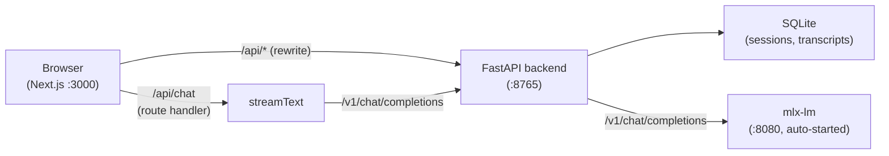

# Local Meeting Assistant

A fully local, privacy-first meeting assistant for Apple Silicon Macs. Records meetings, transcribes them on-device using Whisper via MLX, and lets you chat with an on-device LLM — no cloud, no API keys.

## Architecture



The backend auto-starts the `mlx-lm` server on first request and proxies all `/v1/chat/completions` calls to it. You only need to run two processes.

## Features

- **Sessions** — browse past recordings with duration and status
- **Record** — capture audio locally; transcription runs on-device via Whisper + MLX
- **Transcript** — view timestamped transcript for any session
- **Chat** — stream responses from a local Qwen2.5-7B LLM; uses the same OpenAI-compatible API

## Models

| Role | Model | Size |
|---|---|---|
| STT | `mlx-community/whisper-large-v3-turbo` | ~800 MB |
| LLM | `mlx-community/Qwen2.5-7B-Instruct-4bit` | ~4.5 GB |

**Total: ~5.3 GB** downloaded on first run to `~/.cache/huggingface/hub/`.

---

## Requirements

- macOS with Apple Silicon (M1 or later)
- Python 3.12+
- [uv](https://docs.astral.sh/uv/) package manager
- Node.js 18+
- `portaudio` (for microphone recording)

---

## Setup

### 1. Install system dependencies

```bash
brew install portaudio
```

### 2. Install Python dependencies

```bash
uv sync
```

### 3. Download models

```bash
uv run python scripts/setup_models.py
```

To download only Whisper (recording without chat):

```bash
uv run python scripts/setup_models.py --whisper-only
```

### 4. Install frontend dependencies

```bash
cd frontend
npm install
```

---

## Running

Open two terminals from the project root.

**Terminal 1 — Backend** (FastAPI + mlx-lm, binds to `127.0.0.1:8765`):

```bash
uv run python -m backend.main
```

The backend will automatically start the `mlx-lm` server as a subprocess on port `8080` and wait until it is healthy before accepting chat requests. First startup takes a few minutes while the model loads into memory.

**Terminal 2 — Frontend** (Next.js dev server, `http://localhost:3000`):

```bash
cd frontend
npm run dev
```

Open [http://localhost:3000](http://localhost:3000).

---

## Configuration

Override defaults with environment variables:

| Variable | Default | Description |
|---|---|---|
| `API_HOST` | `127.0.0.1` | Bind address for the FastAPI server |
| `API_PORT` | `8765` | Port for the FastAPI server |
| `LLM_MODEL` | `mlx-community/Qwen2.5-7B-Instruct-4bit` | Model passed to `mlx-lm` |
| `LLM_PORT` | `8080` | Port for the `mlx-lm` subprocess |
| `MLX_BASE_URL` | `http://localhost:8765/v1` | LLM base URL used by the frontend API route |
| `MLX_MODEL_ID` | `mlx-community/Qwen2.5-7B-Instruct-4bit` | Model ID sent in chat requests |

Example — use a smaller model:

```bash
LLM_MODEL=mlx-community/Qwen2.5-3B-Instruct-4bit \
MLX_MODEL_ID=mlx-community/Qwen2.5-3B-Instruct-4bit \
uv run python -m backend.main
```

---

## Data

All data lives in `data/` (gitignored):

```
data/
└── meetings.db    # SQLite: sessions, recordings, transcripts
```

---

## Troubleshooting

**Microphone access denied**

Go to System Settings → Privacy & Security → Microphone and enable access for your terminal app.

**"Backend offline" in status bar**

The FastAPI server is not running. Start it with `uv run python -m backend.main`.

**Chat returns errors / no response**

The mlx-lm server may still be loading. Check Terminal 1 for `"mlx-lm server ready"`. First load takes 1–3 minutes.

**Model missing warning**

```bash
uv run python scripts/setup_models.py
```

---

## Development

**Run backend tests:**

```bash
uv run pytest
```

**Build frontend for production:**

```bash
cd frontend
npm run build
npm start
```
