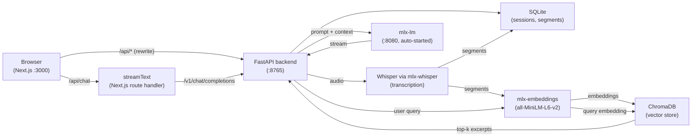

# Local Meeting Assistant

A fully local, privacy-first meeting assistant for Apple Silicon Macs. Records meetings, transcribes them on-device using Whisper via MLX, and lets you chat with a local LLM — with answers grounded in your actual transcripts via RAG. No cloud, no API keys.

## Architecture



The backend auto-starts the `mlx-lm` server on first request. When audio is uploaded, Whisper transcribes it and the segments are both stored in SQLite and embedded into ChromaDB. On each chat turn, the user's query is embedded, the top-5 most relevant transcript excerpts are retrieved, and they are injected into the system prompt before the request is forwarded to `mlx-lm`. You only need to run two processes.

## Features

- **Sessions** — browse past recordings with duration and status
- **Record** — capture audio locally; transcription runs on-device via Whisper + MLX
- **Transcript** — view timestamped transcript for any session
- **Chat** — answers streamed from a local Qwen2.5-7B LLM, grounded in your transcripts via RAG; relevant excerpts are retrieved from ChromaDB and injected into the prompt automatically

## Models

| Role | Model | Size |
|---|---|---|
| STT | `mlx-community/whisper-large-v3-turbo` | ~800 MB |
| LLM | `mlx-community/Qwen2.5-7B-Instruct-4bit` | ~4.5 GB |
| Embeddings | `mlx-community/all-MiniLM-L6-v2-4bit` | ~22 MB |

**Total: ~5.3 GB** downloaded on first run to `~/.cache/huggingface/hub/`.

---

## Requirements

- macOS with Apple Silicon (M1 or later)
- Python 3.12+
- [uv](https://docs.astral.sh/uv/) package manager
- Node.js 18+
- `portaudio` (for microphone recording)

---

## Setup

### 1. Install system dependencies

```bash
brew install portaudio
```

### 2. Run setup

```bash
make setup
```

This installs Python and frontend dependencies, downloads all models (~5.3 GB), and syncs the vector database.

---

## Running

Open two terminals from the project root.

**Terminal 1 — Backend** (FastAPI + mlx-lm, binds to `127.0.0.1:8765`):

```bash
make backend
```

The backend will automatically start the `mlx-lm` server as a subprocess on port `8080` and wait until it is healthy before accepting chat requests. First startup takes a few minutes while the model loads into memory.

**Terminal 2 — Frontend** (Next.js dev server, `http://localhost:3000`):

```bash
make frontend
```

Open [http://localhost:3000](http://localhost:3000).

Or start both in a single split tmux session:

```bash
make dev
```

---

## Make targets

| Target | Description |
|---|---|
| `make setup` | Full first-time setup: install deps, download models, sync vector DB |
| `make install` | Install Python + frontend dependencies only |
| `make models` | Download and warm up Whisper + embedding models |
| `make backend` | Start FastAPI backend (also starts mlx-lm subprocess on :8080) |
| `make frontend` | Start Next.js dev server |
| `make dev` | Start both in a split tmux session |
| `make check` | Report model cache and ChromaDB index status |
| `make sync-db` | Index any sessions missing from ChromaDB |
| `make reindex` | Wipe ChromaDB and rebuild from scratch |
| `make test` | Run backend tests |
| `make lint` | Run ruff linter |
| `make clean` | Delete `data/meetings.db`, `data/chromadb/`, `data/uploads/` |

---

## Configuration

Override defaults with environment variables:

| Variable | Default | Description |
|---|---|---|
| `API_HOST` | `127.0.0.1` | Bind address for the FastAPI server |
| `API_PORT` | `8765` | Port for the FastAPI server |
| `LLM_MODEL` | `mlx-community/Qwen2.5-7B-Instruct-4bit` | Model passed to `mlx-lm` |
| `LLM_PORT` | `8080` | Port for the `mlx-lm` subprocess |
| `MLX_BASE_URL` | `http://localhost:8765/v1` | LLM base URL used by the frontend API route |
| `MLX_MODEL_ID` | `mlx-community/Qwen2.5-7B-Instruct-4bit` | Model ID sent in chat requests |

Example — use a smaller model:

```bash
LLM_MODEL=mlx-community/Qwen2.5-3B-Instruct-4bit \
MLX_MODEL_ID=mlx-community/Qwen2.5-3B-Instruct-4bit \
uv run python -m backend.main
```

---

## Data

All data lives in `data/` (gitignored):

```
data/
├── meetings.db    # SQLite: sessions, recordings, transcripts
├── chromadb/      # ChromaDB vector store (RAG index)
└── uploads/       # Raw audio files
```

---

## Troubleshooting

**Microphone access denied**

Go to System Settings → Privacy & Security → Microphone and enable access for your terminal app.

**"Backend offline" in status bar**

The FastAPI server is not running. Start it with `uv run python -m backend.main`.

**Chat returns errors / no response**

The mlx-lm server may still be loading. Check Terminal 1 for `"mlx-lm server ready"`. First load takes 1–3 minutes.

**Model missing warning**

```bash
uv run python scripts/setup_models.py
```

---

## Development

**Run backend tests:**

```bash
uv run pytest
```

**Build frontend for production:**

```bash
cd frontend
npm run build
npm start
```
